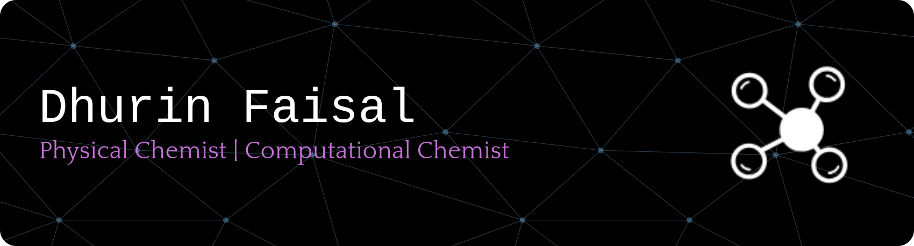

<h2 align="center">Hi there, I'm Dhurin Faisal 👋</h2>

- 🧪 Physical Chemist | Computational Chemist  
- 🔭 Currently working on Ionic Liquid Simulation with GROMACS  
- 🌱 Learning Python, SQLite, HTML, JavaScript, CSS, Bootstrap

---

### 💻 OS

### 📊 Office

### 🐍 Languages

### 🗄️ Database

### 🎨 Design

### 🧩 Framework

### 🛠️ IDE

---
<picture>
  <source media="(prefers-color-scheme: dark)" srcset="https://raw.githubusercontent.com/d-bestari/d-bestari/output/pacman-contribution-graph-dark.svg">
  <source media="(prefers-color-scheme: light)" srcset="https://raw.githubusercontent.com/d-bestari/d-bestari/output/pacman-contribution-graph.svg">
  
</picture>

###
